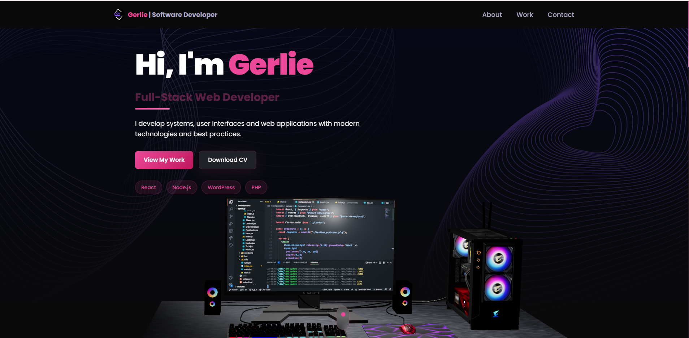

<div align="center">
  
  <h1 align="center">🚀 Gerlie's 3D Portfolio</h1>
  <p align="center">A stunning 3D interactive portfolio showcasing modern web development skills</p>
  
  <p align="center">
    <a href="#live-demo">Live Demo</a> •
    <a href="#features">Features</a> •
    <a href="#tech-stack">Tech Stack</a> •
    <a href="#quick-start">Quick Start</a>
  </p>
</div>

---

## 📋 About

Welcome to my 3D Portfolio! This is a modern, interactive web portfolio built with cutting-edge technologies to showcase my skills as a **Full-Stack Web Developer**, **React Developer**, and **WordPress Developer**.

The portfolio features stunning 3D graphics, smooth animations, and an engaging user experience that demonstrates both technical expertise and creative design thinking.

## ✨ Key Features

### 🎯 **Interactive 3D Experience**
- **3D Desktop Model**: Customizable 3D computer model in the hero section
- **3D Earth Model**: Interactive globe in the contact section
- **3D Stars Background**: Dynamic star field using Three.js
- **3D Skills Visualization**: Skills displayed using 3D geometries

### 🎨 **Modern Design & Animations**
- **Framer Motion**: Smooth, professional animations throughout
- **Glassmorphism Effects**: Modern glass-like UI elements
- **Responsive Design**: Perfect on all devices and screen sizes
- **Dark Theme**: Elegant dark color scheme with pink accents

### 📱 **Professional Sections**
- **Animated Hero**: Dynamic role titles and skill badges
- **Interactive Projects**: Showcase of development work
- **Experience Timeline**: Professional work history
- **Contact Form**: Integrated with EmailJS for seamless communication

## 🛠️ Tech Stack

<div align="center">

| Frontend | 3D Graphics | Styling | Animation | Backend |
|----------|-------------|---------|-----------|---------|
| React.js | Three.js | Tailwind CSS | Framer Motion | EmailJS |
| Vite | React Three Fiber | CSS3 | React Spring | - |
| JavaScript | React Three Drei | - | - | - |

</div>

## 🚀 Live Demo

**[View Live Portfolio](https://your-portfolio-url.com)**

## 🎯 Features Breakdown

### **Hero Section**
- ✅ Interactive 3D desktop model
- ✅ Animated role titles (Full-Stack, React, WordPress Developer)
- ✅ Dynamic skill badges
- ✅ Smooth entrance animations
- ✅ Professional CTA buttons

### **About Section**
- ✅ Service cards with hover effects
- ✅ Statistics showcase
- ✅ Professional presentation

### **Experience Section**
- ✅ Vertical timeline component
- ✅ Work history with animations
- ✅ Professional styling

### **Tech Stack Section**
- ✅ 3D skill visualization
- ✅ Interactive technology cards
- ✅ Category organization

### **Projects Section**
- ✅ Animated project cards
- ✅ Tilt effects on hover
- ✅ Project descriptions and links

### **Contact Section**
- ✅ 3D Earth model
- ✅ EmailJS integration
- ✅ Contact form validation
- ✅ Professional styling

## 🏃‍♂️ Quick Start

### **Prerequisites**

Make sure you have the following installed on your machine:

- [Git](https://git-scm.com/)
- [Node.js](https://nodejs.org/en) (v16 or higher)
- [npm](https://www.npmjs.com/) (Node Package Manager)

### **Cloning the Repository**

```bash
git clone git@github.com:gerlieroiles7/3D-Portfolio-Website.git
cd 3D-Portfolio-Website
```

### **Installation**

Install the project dependencies using npm:

```bash
npm install
```

### **Environment Setup**

Create a `.env` file in the root directory:

```env
REACT_APP_EMAILJS_USERID=your_emailjs_user_id
REACT_APP_EMAILJS_TEMPLATEID=your_emailjs_template_id
REACT_APP_EMAILJS_RECEIVERID=your_emailjs_receiver_id
```

> **Note**: Get your EmailJS credentials from [EmailJS website](https://www.emailjs.com/)

### **Running the Project**

```bash
npm run dev
```

Open [http://localhost:5173](http://localhost:5173) in your browser to view the project.

## 📁 Project Structure

```
3d_portfolio/
├── public/
│   ├── desktop_pc/          # 3D desktop model assets
│   └── planet/              # 3D earth model assets
├── src/
│   ├── components/
│   │   ├── canvas/          # 3D components (Computers, Earth, Stars)
│   │   ├── Hero.jsx         # Main hero section
│   │   ├── About.jsx        # About section
│   │   ├── Experience.jsx   # Work experience
│   │   ├── Tech.jsx         # Skills section
│   │   ├── Works.jsx        # Projects section
│   │   ├── Contact.jsx      # Contact form
│   │   └── Navbar.jsx       # Navigation
│   ├── assets/              # Images and static assets
│   ├── constants/           # Configuration data
│   ├── styles.js            # Tailwind CSS classes
│   └── utils/               # Utility functions
└── README.md
```

## 🎨 Customization

### **Colors & Theme**
- Edit `tailwind.config.cjs` to customize colors
- Modify `src/index.css` for global styles
- Update component-specific styling in individual files

### **3D Models**
- Replace 3D models in `public/` directory
- Update model references in canvas components
- Customize lighting and materials in Three.js components

### **Content**
- Update personal information in `src/constants/index.js`
- Modify project data in `src/components/Works.jsx`
- Edit experience timeline in `src/components/Experience.jsx`

## 🤝 Contributing

Contributions are welcome! Please feel free to submit a Pull Request.

## 📄 License

This project is licensed under the MIT License - see the [LICENSE](LICENSE) file for details.

## 📞 Contact

- **Portfolio**: [Your Portfolio URL]
- **LinkedIn**: [Your LinkedIn]
- **GitHub**: [@gerlieroiles7](https://github.com/gerlieroiles7)
- **Email**: [Your Email]

---

<div align="center">
  <p>Made with ❤️ by <strong>Gerlie</strong></p>
  <p>If you like this project, please give it a ⭐</p>
</div>
